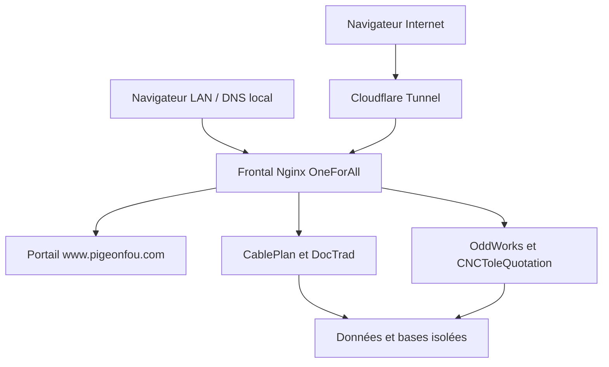

# Architecture

Le service `oneforall-nginx` utilise `/etc/oneforall/nginx.conf` et n’inclut pas les sites du service Nginx historique. Il ne remplace pas Apache ni les tunnels existants. Les ports 8443 sur l’IP LAN et 18080 sur localhost limitent les collisions avec les installations actuelles sur 80/443/8081. Ces ports sont configurables.

| Élément | Chemin / service |
|---|---|
| Gestionnaire privilégié | `/opt/oneforall/manager` (root, non modifiable par le runner) |
| Portail | `/opt/oneforall/portal` |
| Versions applicatives | `/opt/oneforall/apps/<id>/releases/<SHA>` |
| Version active | `/opt/oneforall/apps/<id>/current` (lien atomique) |
| Dépôts Git de lecture | `/opt/oneforall/sources/<id>.git` |
| Configuration commune | `/etc/oneforall/site.json` |
| Secrets applicatifs | `/etc/oneforall/apps/<id>.json` et `.env` |
| Données | `/var/lib/oneforall/<id>` |
| Sauvegardes | `/var/backups/oneforall/<id>/<date>` |
| Journal d’interruption | `/var/lib/oneforall/pending/<id>.json` |
| Contrôles du portail | `oneforall-status.timer` et fichiers publics sans secrets |

| Application | Utilisateur | Backend | Base |
|---|---|---|---|
| CablePlan | `ofa-cableplan` | socket `/run/oneforall-cableplan/app.sock` | SQLite dans son dossier de données |
| DocTrad | `ofa-doctrad` | web localhost:18102, runtime localhost:18112, worker | PostgreSQL `ofa_doctrad` |
| OddWorks | `ofa-oddworks` | pool PHP-FPM et socket propres | SQLite dans son dossier de données |
| CNC | `ofa-cnctolequotation` | pool PHP-FPM et socket propres | MariaDB `ofa_cnctolequotation` |

Les bases, cookies, pools PHP et environnements Python sont séparés. Les versions applicatives sont rendues non modifiables après préparation. Les données et modèles persistants restent hors des versions.

L’entrée Cloudflare remplace les en-têtes de canal, d’origine proxy et de protocole. Elle ne fait jamais passer une requête Internet pour une requête LAN CablePlan. L’activation du frontal public et la liste `public_apps` sont des conditions supplémentaires : elles ne désactivent pas les restrictions propres aux applications.

Le statut est rafraîchi toutes les 30 secondes. Un contrôle de plus de 180 secondes est considéré comme périmé par le portail. Une erreur HTTP ou une base indisponible ne devient jamais un simple voyant vert. CNC vérifie aussi ses modèles et l’import OpenCascade ; DocTrad signale l’absence de modèles prêts.

## Pourquoi des sous-domaines

CablePlan utilise `/api`, `/static` et ses cookies à la racine. DocTrad utilise `/login`, `/jobs`, `/static` et des redirections absolues. CNC appelle `/api/v1/quote` et ses pages historiques ont des chemins locaux fixes. Les préfixes auraient exigé une adaptation étendue des routes et des tests de tous les exports. Les sous-domaines maintiennent les contrats existants et isolent les cookies entre applications.

OddWorks a un helper de base d’URL : l’adaptation rend sa base configurable. La valeur `/` utilisée par PHP-FPM est normalisée en racine, tandis que l’installation historique conserve `/gestion-projet` par défaut.

## Limites d’exploitation

Le portail n’est pas une interface web d’administration root : installation, exposition Internet et restauration passent par le menu SSH ou les commandes privilégiées. Un upload de modèles est un import depuis un dossier local vérifié, pas un téléchargement d’IA distant pendant le traitement métier.

Un arrêt court des services est nécessaire pour obtenir une sauvegarde cohérente. Les modèles sont inclus : prévoir l’espace disque correspondant. Les sauvegardes ne sont pas purgées automatiquement.
